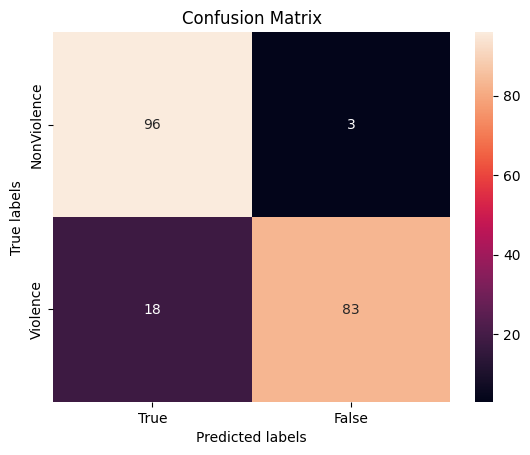

# MobileNetV2-BiLSTM-para-analises-de-videos-de-violencia
Projeto que combina uma CNN **MobileNetV2** para extração de features espaciais com uma RNN **Bi-LSTM** para modelar dependências temporais em vídeos de vigilância, com o objetivo de detectar cenas com possível violência. O foco é em eficiência (rodar em edge/ambientes com GPU limitada) e em obter um pipeline pronto para treinar, avaliar e fazer inferência em arquivos de vídeo.

##Motivação:
---
##Tecnologias Utilizadas:
---
- python 3.11
- Numpy
- Tensorflow/Keras
- matplotlib
- sklearn

##Estrutura do Projeto:
---
o código foi desenvolvido com Jupiter, o dataset de treino esta disponivel no kaggle, apartir do link abaixo:</br>
https://www.kaggle.com/datasets/mohamedmustafa/real-life-violence-situations-dataset</br>
o dataset apresenta duas classes, violencia e sem violencia, cada classe apresenta 1000 videos de 5 segundos. para realizar o treinamento, cada classe utilizará 90% do dataset em treinamento e 10% em validação.</br>
o treinamento utilizou 50 epocas e para verificação do treino, utilizo 3 metricas, a matriz de confusão e a acuracia.

##Resultados:
---
o treinamento foi bem sastifatorio, talvez algumas mudanças em alguns paramentos e o aumento de epocas podem melhorar ainda mais os resultados. o treinamento obteve 82% de acuracia e o grafico abaixo demonstra a classificação de cada classe:



## Como Executar o Projeto
---
```bash
# 1️⃣ Clonar o repositório
git clone https://github.com/CiroKyushima/MobileNetV2-BiLSTM-para-analises-de-videos-de-violencia.git

# 2️⃣ Instalar as dependências
pip install -r requirements.txt

# 3️⃣ Abrir o Jupyter Notebook
jupyter notebook main.ipynb
